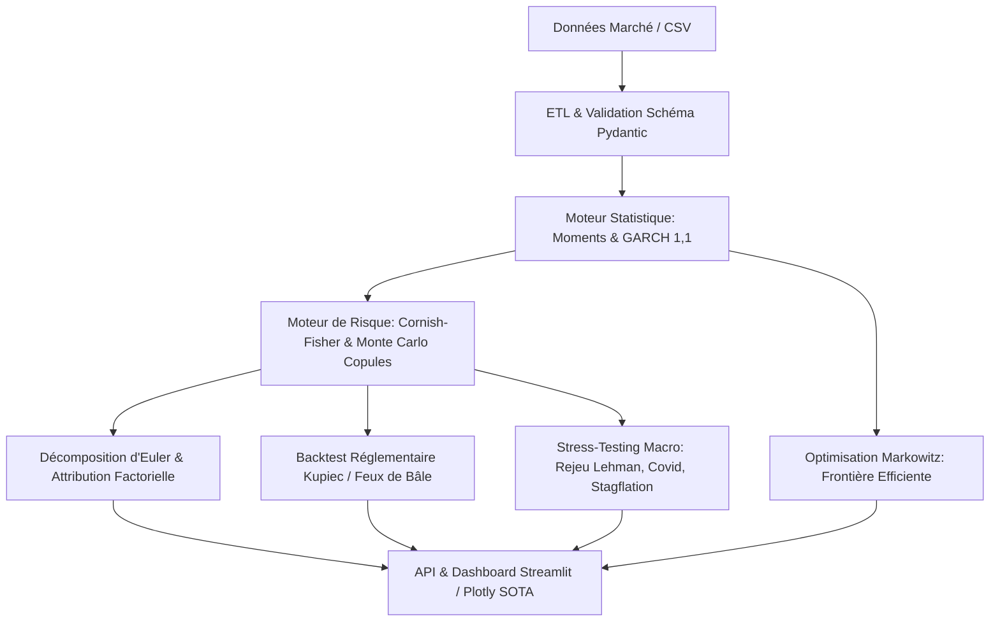

# FinSight — Quantitative Risk & Volatility Analytics Engine (R&D / Enterprise Grade)

[](https://www.python.org/downloads/)
[]()
[](https://opensource.org/licenses/MIT)

## 📌 Executive Summary

**FinSight** est une plateforme institutionnelle de modélisation du risque financier, de stress-testing macro-économique et d'optimisation quantitative de portefeuille. Conçue selon les standards les plus exigeants de la R&D quantitative (normes prudentielles de **Bâle II / Bâle III**), elle dépasse les hypothèses simplistes de normalité des rendements en intégrant les moments d'ordre supérieur, le clustering de volatilité et les dépendances non linéaires à queues épaisses.

---

## 🔬 Fondements Mathématiques & Algorithmiques

### 1. Expansion de Cornish-Fisher (Higher Moments VaR)
Pour modéliser l'asymétrie ($S$) et l'excès de kurtosis ($\kappa$) caractéristiques des séries financières (*fat tails*), le quantile gaussien standard $z_\alpha$ est corrigé par l'expansion de Cornish-Fisher :

$$z_{\text{CF}}(\alpha) = z_\alpha + \frac{(z_\alpha^2 - 1) S}{6} + \frac{(z_\alpha^3 - 3z_\alpha) \kappa}{24} - \frac{(2z_\alpha^3 - 5z_\alpha) S^2}{36}$$

$$\text{VaR}_\alpha = -\left( \mu \Delta t + z_{\text{CF}}(\alpha) \sigma \sqrt{\Delta t} \right)$$

### 2. Modélisation de la Volatilité Dynamique GARCH(1,1)
La dynamique de la variance conditionnelle $\sigma_t^2$ est estimée par Quasi-Maximum de Vraisemblance (QMLE) sous contrainte de stationnarité ($\alpha + \beta < 1$) et *variance targeting* :

$$\sigma_t^2 = \omega + \alpha \epsilon_{t-1}^2 + \beta \sigma_{t-1}^2 \quad \text{avec} \quad \omega = V_L (1 - \alpha - \beta)$$

Prévision analytique de la structure par terme à l'horizon $h$ :
$$\mathbb{E}[\sigma_{t+h}^2] = V_L + (\alpha + \beta)^h (\sigma_t^2 - V_L)$$

### 3. Simulation Monte Carlo avec Copules $t$-Student
Génération de scénarios de chocs corrélés avec queues lourdes via factorisation de Cholesky $\mathbf{\Sigma} = \mathbf{L} \mathbf{L}^T$ et distribution de Student multivariée ($\nu = 5$) :

$$\mathbf{Z}_{\text{corr}} = \mathbf{L} \mathbf{U}, \quad \mathbf{U} \sim t_\nu(0, \mathbf{I})$$

### 4. Décomposition du Risque d'Euler (Attribution & Allocation)
En vertu du théorème d'Euler sur les fonctions homogènes de degré 1 :

$$\text{VaR}_p = \sum_{i=1}^N w_i \cdot \text{MVaR}_i \quad \text{où} \quad \text{MVaR}_i = \frac{\partial \text{VaR}_p}{\partial w_i} = \beta_i^p \cdot \text{VaR}_p$$

### 5. Backtesting Réglementaire (Test de Kupiec POF & Cadre de Bâle)
Validation statistique du taux d'exception $x/T$ par test de rapport de vraisemblance :

$$\text{LR}_{\text{POF}} = -2 \ln \left[ \frac{(1-p)^{T-x} p^x}{(1-\hat{p})^{T-x} \hat{p}^x} \right] \sim \chi^2(1)$$

---

## 🏛️ Architecture MLOps & Génie Logiciel



---

## 🚀 Installation & Exécution

```bash
# Installation des dépendances
pip install numpy scipy pydantic plotly streamlit pytest

# Lancer le Dashboard interactif Streamlit
streamlit run app.py

# Exécuter la suite de tests mathématiques
pytest tests/ -v
```
